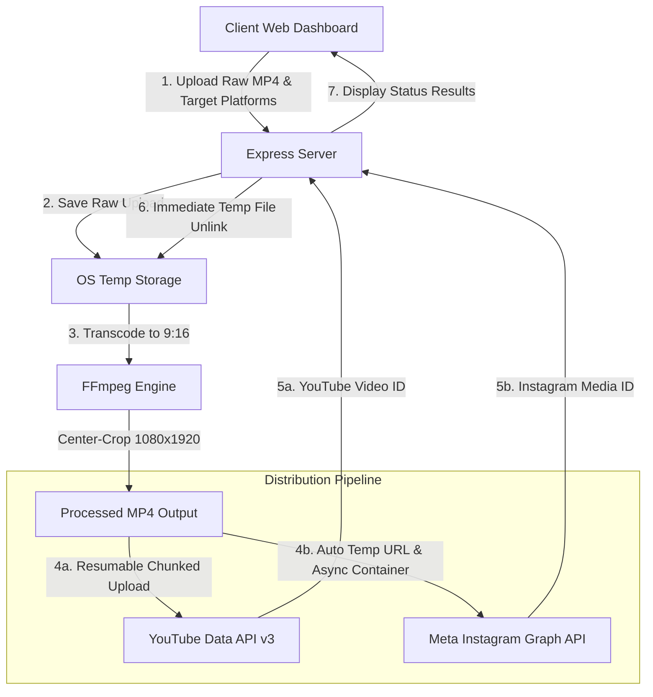

# Automated Short-Video Publisher & QA Test Suite 🎥


A stateless, full-stack video processing and distribution engine built with **Node.js**, **Express**, **FFmpeg**, **YouTube Data API v3**, and the **Meta Instagram Graph API**, paired with an **automated Quality Assurance & API testing framework**.

Upload raw videos of any aspect ratio, automatically transcode them into standard **9:16 vertical short-form videos (1080x1920)**, and publish them seamlessly to **YouTube Shorts** and **Instagram Reels**, with single-click target platform controls.

---

## 🌟 Highlights

* 🎬 **Automated 9:16 FFmpeg Transcoding**: Scale and center-crop any input video into standard 1080x1920 H.264/AAC MP4 optimized for vertical mobile feeds (`yuv420p` + `+faststart`).
* 🎯 **Flexible Target Platform Selection**: Select YouTube Shorts, Instagram Reels, or both simultaneously without hardcoded constraints.
* ⚡ **Resumable Chunked YouTube Uploads**: Implements YouTube's resumable upload protocol (`PUT` requests with `Content-Range` headers) for high-reliability video transfers.
* 🔄 **Automated Instagram Container Flow**: Self-hosts processed videos on temporary server routes for Meta's 3-step async container pipeline (Create -> Poll -> Publish), eliminating manual URL inputs.
* 🔐 **AES-256-GCM Cookie Encryption**: Stateless session management storing OAuth access and refresh tokens inside encrypted `HttpOnly`, `SameSite=Strict` cookies.
* 🧹 **Auto-Cleaning & Stateless**: Processed media files and temporary uploads are automatically unlinked immediately post-publish.

---

## 📐 Architecture & System Flow



---

## 🛠️ Tech Stack

* **Backend Engine**: Node.js, Express.js
* **Media Transcoding**: FFmpeg (`ffmpeg-static`), Node Child Process streams
* **Security & Auth**: OAuth 2.0 (Google & Meta), AES-256-GCM authenticated encryption (`node:crypto`)
* **File Uploads**: Multer stream validation
* **Frontend**: HTML5, Vanilla JavaScript, Tailwind CSS (Glassmorphism Dashboard)
* **Deployment**: Azure App Service / Node Environment

---

## 🔌 API Reference

### Authentication Routes

| Method | Endpoint | Description |
| :--- | :--- | :--- |
| `GET` | `/auth/youtube` | Initiates Google OAuth 2.0 flow with YouTube upload scopes |
| `GET` | `/auth/youtube/callback` | OAuth callback; exchanges code for tokens & sets encrypted cookie |
| `GET` | `/auth/instagram` | Initiates Meta OAuth 2.0 flow for Instagram Business accounts |
| `GET` | `/auth/instagram/callback` | Meta OAuth callback; exchanges code for long-lived access token |
| `GET` | `/api/auth-status` | Returns authentication state for YouTube and Instagram |

### Publishing & Core Routes

| Method | Endpoint | Description |
| :--- | :--- | :--- |
| `GET` | `/health` | Server health check endpoint |
| `POST` | `/api/publish` | Transcodes video to 9:16 and publishes to selected target platforms |
| `GET` | `/temp/:filename` | Serves processed videos temporarily for Meta Graph API container fetching |

---

## 🧪 Automated Testing & Quality Assurance

This repository incorporates a lightweight, automated Quality Assurance (QA) suite designed to validate API contracts, security header policies, and input boundary conditions.

### Test Coverage Highlights

* 🟢 **Health & Contract Validation**: Verifies HTTP 200 responses, status payloads, and timestamp formats on `/health`.
* 🔐 **Security & Cookie Verification**: Validates `HttpOnly` and `SameSite=Strict` cookie settings for OAuth state cookies (`yt_oauth_state`, `ig_oauth_state`) to prevent OAuth state collisions.
* 🛑 **Boundary & Input Validation**: Validates 400 Bad Request error handling when `/api/publish` receives missing or malformed video payloads.
* ⚙️ **CI/CD Quality Gate**: Continuous integration pipeline (`.github/workflows/test.yml`) running automated regression tests on every push and pull request.
* 📬 **Postman Collection**: Pre-configured API workspace collection available in [`lib/postman`](lib/postman).

### Executing Automated Tests

Run the test suite locally using the native test runner:

```bash
npm test
```

---

## 🚀 Local Setup & Development

### Prerequisites

* **Node.js** (v18 or higher)
* **npm**
* **Google Cloud Console Project** with **YouTube Data API v3** enabled
* **Meta for Developers App** with **Instagram Graph API** permissions

### 1. Clone & Install

```bash
git clone https://github.com/Inquisiter0/video-publisher.git
cd video-publisher
npm install
```

### 2. Configure Environment Variables

Create a `.env` file in the project root:

```env
PORT=3000
COOKIE_SECRET=your_random_32_character_secret_key!

# Google / YouTube OAuth
GOOGLE_CLIENT_ID=your_google_client_id.apps.googleusercontent.com
GOOGLE_CLIENT_SECRET=your_google_client_secret
GOOGLE_REDIRECT_URI=http://localhost:3000/auth/youtube/callback

# Meta / Instagram OAuth
INSTAGRAM_CLIENT_ID=your_instagram_app_id
INSTAGRAM_CLIENT_SECRET=your_instagram_app_secret
INSTAGRAM_REDIRECT_URI=http://localhost:3000/auth/instagram/callback
```

### 3. Run Application

```bash
npm start
```

Open [http://localhost:3000](http://localhost:3000) in your browser.

---

## 🔒 Security & Privacy

* **Zero Persistent Database**: Tokens are stored strictly inside encrypted client cookies.
* **Authenticated Encryption**: Uses AES-256-GCM with SHA-256 key derivation for cookie token protection.
* **Ephemeral File Lifecycle**: Media files are automatically purged post-publish to guarantee zero data retention.

---

## 📄 License

MIT License. Free for personal and commercial use.
