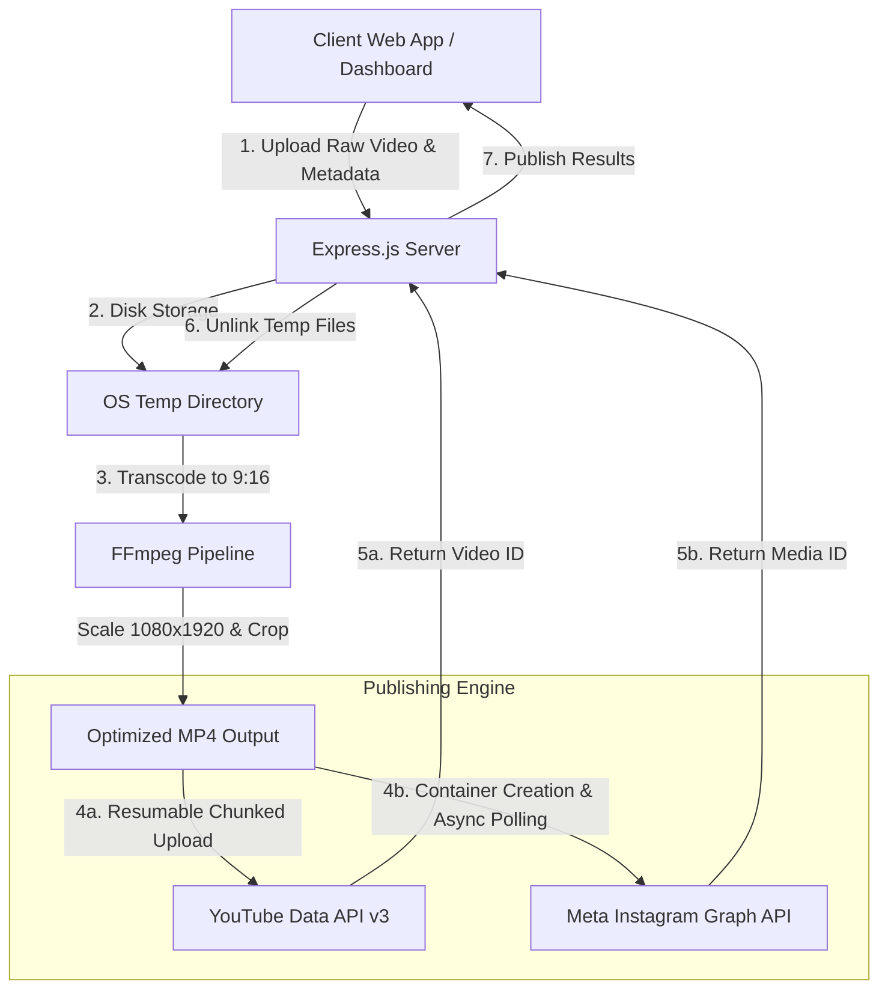

# Automated Short-Video Publisher 🎥

A stateless, full-stack video processing and automated distribution platform built with **Node.js**, **Express**, **FFmpeg**, **YouTube Data API v3**, and the **Meta Instagram Graph API**.

It allows users to upload raw videos of any aspect ratio, automatically transcodes them into standard **9:16 vertical short-form videos (1080x1920)**, and publishes them seamlessly to **YouTube Shorts** and **Instagram Reels**.

---

## 🌟 Key Features

* **Automated 9:16 Transcoding Engine**: Converts any video format or aspect ratio into a centered 1080x1920 H.264/AAC MP4 optimized for short-form mobile feeds using **FFmpeg**.
* **Dual-Platform Distribution**: Single-click automated publishing to YouTube Shorts and Instagram Reels.
* **YouTube Resumable Chunked Uploads**: Implements YouTube's resumable upload protocol (`PUT` requests with `Content-Range` headers) to handle large video uploads reliably.
* **Instagram Container & Polling Pipeline**: Handles Meta's 3-step async container flow (Create Media Container -> Poll Status -> Publish Container).
* **Stateless & Auto-Cleaned**: Uploaded raw videos and transcoded outputs are automatically unlinked from server temporary storage after processing.
* **AES-256-GCM Cookie Security**: Uses authenticated AES-256-GCM encryption for storing OAuth access/refresh tokens in `HttpOnly`, `SameSite=Strict` cookies.

---

## 📐 Architecture & Data Flow



---

## 🛠️ Tech Stack

* **Backend Engine**: Node.js, Express.js
* **Media Processing**: FFmpeg (`ffmpeg-static`)
* **File Processing**: Multer (disk storage stream limits)
* **Security & Auth**: OAuth 2.0 (Google & Meta), AES-256-GCM encrypted cookies (`node:crypto`)
* **Frontend**: HTML5, Vanilla JavaScript, Tailwind CSS (Glassmorphism UI)
* **Deployment**: Azure App Service

---

## 🔌 API Reference

### Authentication Routes

| Method | Endpoint | Description |
| :--- | :--- | :--- |
| `GET` | `/auth/youtube` | Initiates Google OAuth 2.0 flow with YouTube upload scopes |
| `GET` | `/auth/youtube/callback` | OAuth callback endpoint; exchanges code for tokens & sets encrypted cookie |
| `GET` | `/auth/instagram` | Initiates Meta OAuth 2.0 flow for Instagram Business accounts |
| `GET` | `/auth/instagram/callback` | Meta OAuth callback endpoint; exchanges code for long-lived access token |
| `GET` | `/api/auth-status` | Returns authentication state for YouTube and Instagram |

### Publishing & System Routes

| Method | Endpoint | Description |
| :--- | :--- | :--- |
| `GET` | `/health` | Server health check endpoint |
| `POST` | `/api/publish` | Uploads raw video, transcodes to 9:16, and publishes to selected platforms |

---

## 🚀 Getting Started

### Prerequisites

* **Node.js** (v18 or higher)
* **npm**
* **Google Cloud Console Project** with YouTube Data API v3 enabled
* **Meta for Developers App** with Instagram Graph API permissions

### 1. Clone & Install Dependencies

```bash
git clone https://github.com/Inquisiter0/video-publisher.git
cd video-publisher
npm install
```

### 2. Environment Configuration

Create a `.env` file in the project root directory:

```env
PORT=3000
COOKIE_SECRET=your_random_32_character_secret_key!

# Google / YouTube OAuth
GOOGLE_CLIENT_ID=your_google_client_id.apps.googleusercontent.com
GOOGLE_CLIENT_SECRET=your_google_client_secret
GOOGLE_REDIRECT_URI=http://localhost:3000/auth/youtube/callback

# Meta / Instagram OAuth
INSTAGRAM_CLIENT_ID=your_instagram_app_id
INSTAGRAM_CLIENT_SECRET=your_instagram_app_secret
INSTAGRAM_REDIRECT_URI=http://localhost:3000/auth/instagram/callback
```

### 3. Run Locally

```bash
npm start
```

The application will start on `http://localhost:3000`.

---

## 🔒 Security & Privacy

* No user credentials or API tokens are stored in a persistent database.
* All session tokens are encrypted at rest inside `HttpOnly` cookies using AES-256-GCM encryption.
* Media files are temporarily stored in system OS temp folders (`os.tmpdir()`) and purged immediately post-publish.

---

## 📄 License

MIT License. Free for personal and commercial use.
